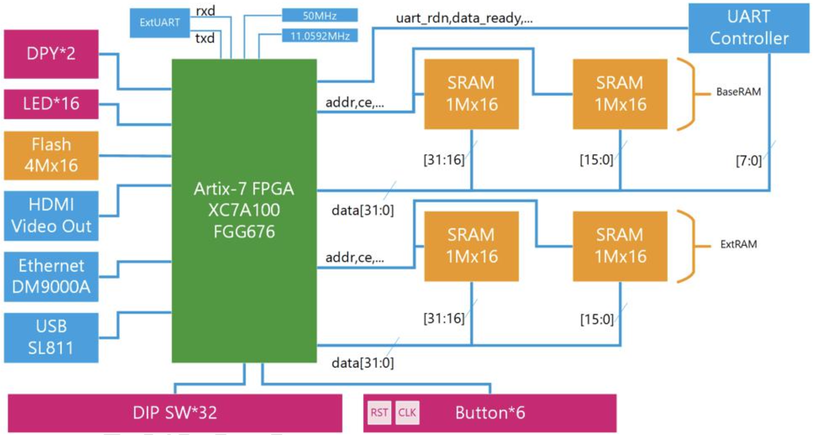
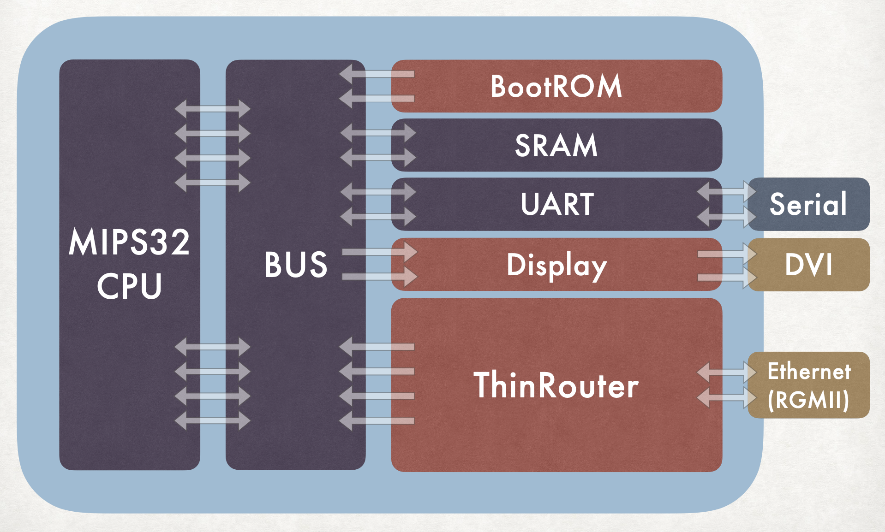

# 计网联合实验 2019 第 4 组

_（计网指《计算机组成原理》和《计算机网络原理》）_

成员：

- 涂轶翔 @Tuyixiang
- 王征翊 @thuwzy
- 赵成钢 @LyricZhao

完整报告：

- [书面总结报告](report.pdf)
- [CPU 部分汇报 PPT](reports/final-cpu-report.pdf)
- [路由器部分汇报 PPT](reports/final-router-report.pdf)

## 项目概要

使用 FPGA 开发板实现了 mips32 CPU 以及路由器。

<figure class="image">
  
  <figcaption>FPGA 开发板结构</figcaption>
</figure>

<figure class="image">
  
  <figcaption>实现框架</figcaption>
</figure>

### 框架逻辑

- CPU 借助总线（Bus）访问 BootROM、SRAM（内存）、UART（外界通讯串口）、Display（显示驱动）、ThinRouter（路由器）。
- 显示器“驱动”由硬件编程实现，CPU 向其传递字符打印指令。
- 路由器（ThinRouter）可以独立工作，与以太网（Ethernet）接口进行数据传递。

### 实现内容

#### CPU

- 实现 MIPS32 指令集的所有常见指令，可以运行 C 程序
  - 包含一个 C 程序可以读取路由器的路由数据，然后以整齐的格式打印在控制台
- 经典五级流水线架构
- 中断、异常的处理
- 优化时序可以在 40MHz 时钟下运行

#### 路由器

- 硬件实现 ARP（子网设备探查）和 RIP（路由更新传播）协议
- 硬件实现 Trie 树查找和更新路由
- 百兆网口单链接单工 94Mbps，双工 186Mbps 传输速率
- RIP 压力测试通过 5000 条路由的记录
